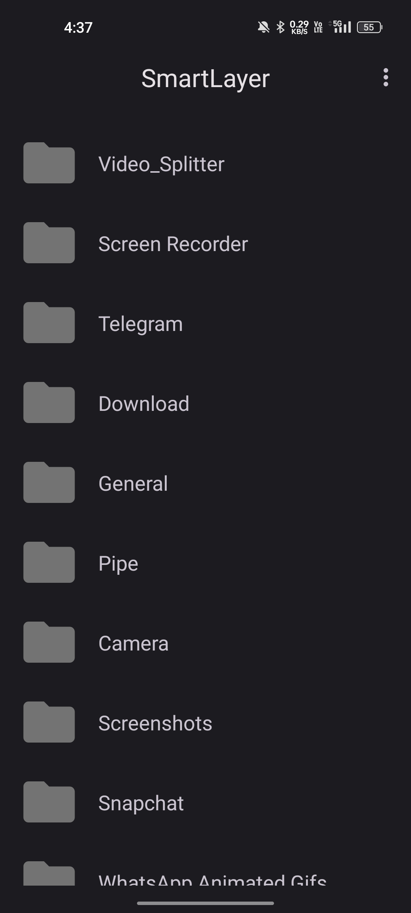
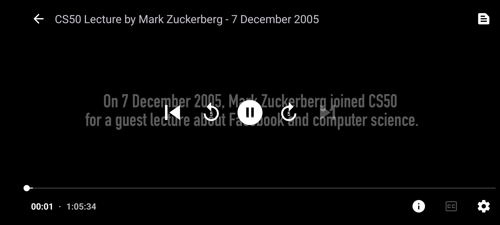
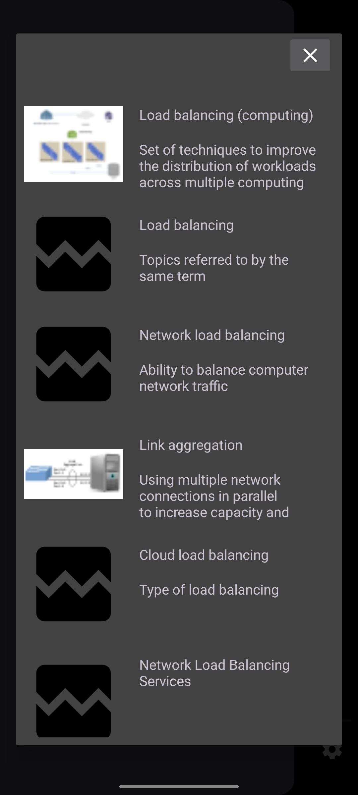
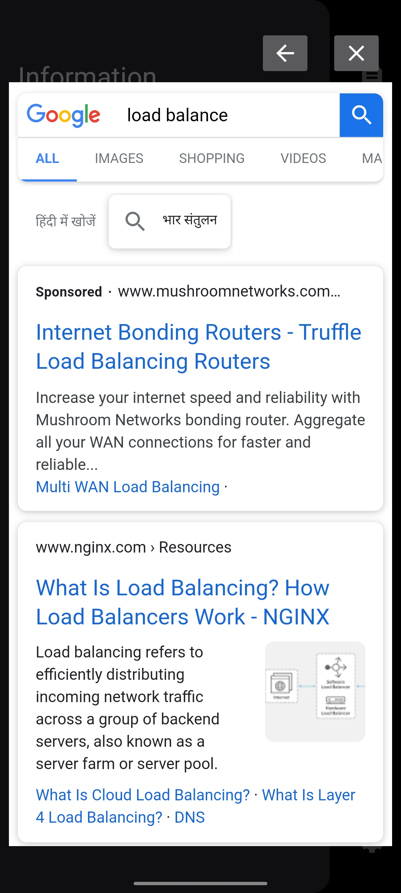
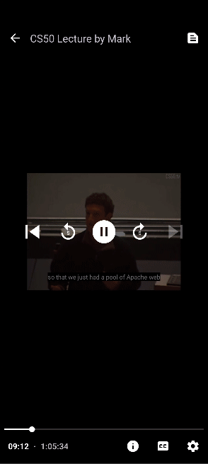
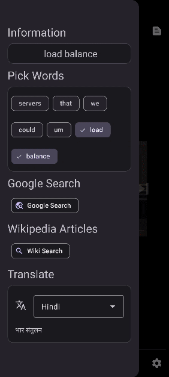

    
    <h1>SmartLayer</h1>
    
An Android application for searching info about the content on the go.

---

### Introduction

SmartLayer is a media player application for Android that enhances the video watching experience by allowing users to interact with subtitles in a smart way. Extract subtitles on the fly, perform searches on Google or Wikipedia articles based on selected words, and translate them, all from within the app. No more going back and forth to learn about content.

## Installation

### Screenshots

Below are some key features highlighted with screenshots from the application:

 
    
    

  
    
    

<table>
  <tr>
    <!-- First GIF Container -->
    <td align="center">
      <h3>Information Drawer</h3>
      
      <ul>
        <li>Just click on the `i` button and choose words of your choice.</li>
          <li>Instant translation as you choose words.</li>
      </ul>
    </td>
    <!-- Second GIF Container -->
    <td align="center">
      <h3>Wikipedia Articles Search</h3>
      
      <ul>
        <li>Search for articles on Wikipedia and read them in web view on the go.</li>
      </ul>
    </td>
    <!-- Third GIF Container -->
    <td align="center">
      <h3>Web Search (Google)</h3>
      
      <ul>
        <li>Make a google search in the webview and surf web pages also.</li>
      </ul>
    </td>
  </tr>
</table>

### Features

- **Media Files**: Access video files from within the app.
- **Video Playback**: Enjoy your favorite videos with a smooth playback experience.
- **Custom Subtitle Track**: Choose your preferred subtitle track from your phone.
- **Info Drawer**: Easily capture the subtitles displayed at any given moment with just a click.
- **Selection**: Highlight a section of the subtitle or just a word of choice and learn about content on the go.
- **Wiki Articles Search**: Search for wiki articles based on chosen words and read article in webview.
- **Integrated Web View**: Search on Google with chosen words and surf webpages.
- **Translation**: Translate the selected subtitles or words into your preferred language instantly.

### Frameworks and Libraries
- **Media3:** A suite of libraries for media playback used in the app to render video media, which is a part of the Android Jetpack suite.
- **ML Kit for Translation:** ML Kit's on-device translation API by Google.Utilized for language translation features within the app.
- **Retrofit:** A type-safe HTTP client for Android and Java, used for network operations and API integration.
- **Coil:** An image loading library for Android, backed by Kotlin Coroutines.
- **OpenNLP Model:** Apache OpenNLP is a machine learning based toolkit for the processing of natural language text,being used in the app for tokenizing string(subtitle text) into tokens (words)
