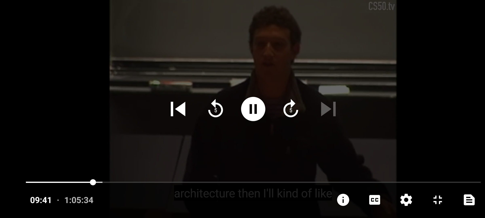
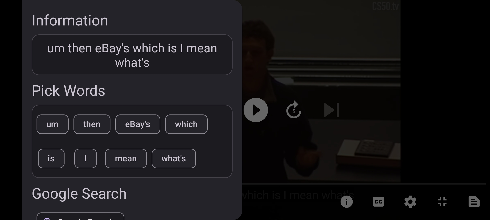
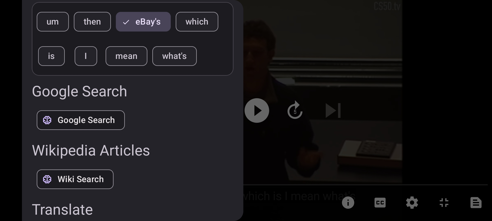
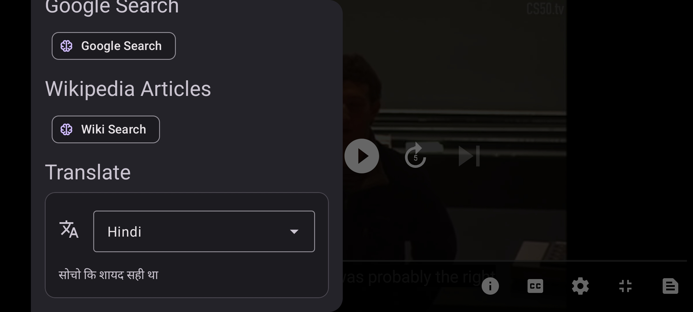
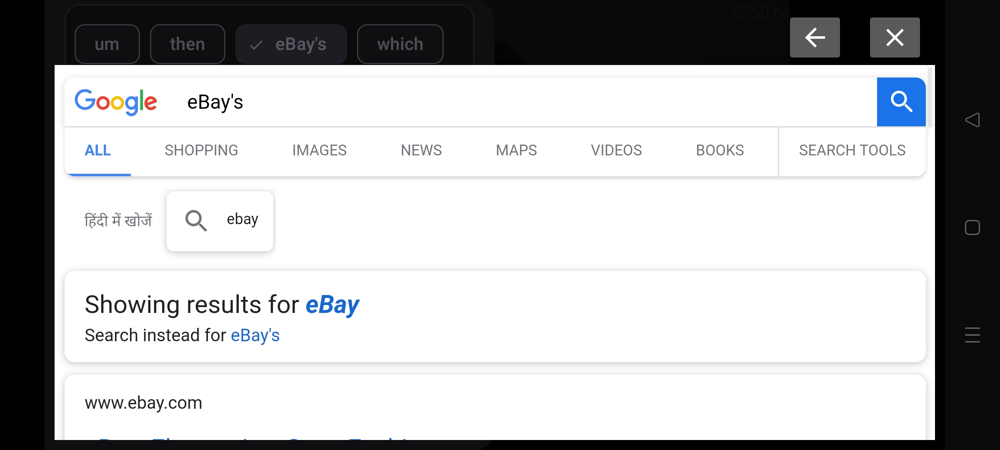
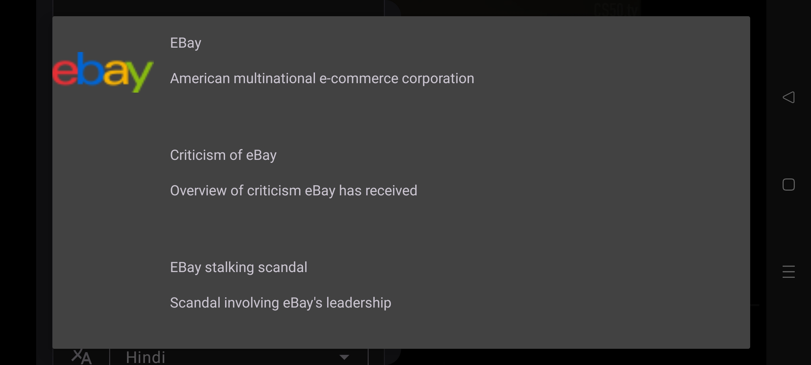

# SmartLayer Media Player

SmartLayer is an intelligent media player application for Android that enhances the video watching experience by allowing users to interact with subtitles in a smart way. Extract subtitles on the fly, perform searches on Google or Wikipedia based on subtitles or selected words, and translate them, all from within the app.

## Features

- **Video Playback**: Enjoy your favorite videos with a smooth playback experience.
- **Subtitle Extraction**: Easily capture the subtitles displayed at any given moment with just a click.
- **Selective Search**: Highlight a section of the subtitle or just a word to initiate a search.
- **Integrated Web View**: Conduct Google and Wikipedia searches and view the results directly within the app, providing a seamless experience.
- **Translation**: Translate the selected subtitles or words into your preferred language instantly.

## Screenshots

Below are some key features highlighted with screenshots from the application:

<table>
  <tr>
    <td>
      <h3>Player View</h3>
      
      
<i>Basic Video player by default comes with <b>Media3</b> with custom <b>i</b> button.</i>

    </td>
    <td>
      <h3>Information Drawer</h3>
      
      
<i>It shows the current subtitle and things we can do with it.</i>

    </td>
  </tr>
  <tr>
    <td>
      <h3>Search Features</h3>
      
      <!-- Description for Search Features can be added here -->
    </td>
    <td>
      <h3>Translation Feature</h3>
      
      
<i>Subtitles can be translated in real-time, providing accessibility in multiple languages.</i>

    </td>
  </tr>
  <tr>
    <td>
      <h3>Web View</h3>
      
      
<i>A built-in web view to browse related content without leaving the application.</i>

    </td>
    <td>
      <h3>Wiki Articles Search</h3>
      
      
<i>Directly search for related Wiki articles within the app for in-depth information.</i>

    </td>
  </tr>
</table>
